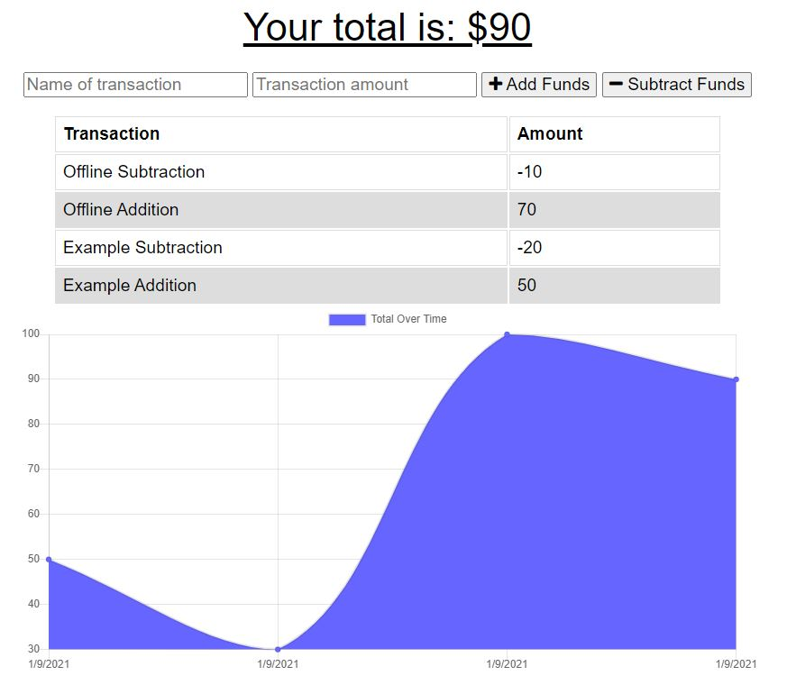

# Online/Offline Budget Tracker

[](https://www.gnu.org/licenses/gpl-3.0)
## Description 
  For this project, we needed to add functionality to an existing budget tracker application to allow for offline access and functionality. Using indexedDB, service workers and other functionality the application should cache the website, record transactions and then publish back to the mongoDB when online.

```
## User Story
AS AN avid traveller
I WANT to be able to track my withdrawals and deposits with or without a data/internet connection
SO THAT my account balance is accurate when I am traveling
```

 <br>

 <br>


  ---
  ## Deployed Application 
  https://andrewhasabudget.herokuapp.com/
    

  ---
  ## Table of Contents

  * [Installation](#installation)
  * [Usage](#usage)
  * [License](#license)
  * [Questions](#questions)


  ---
  ## Installation 
  1. `git clone https://github.com/diemrbond/BudgetTracker` 
  2. `npm install`


  
  ---
  ## Usage 
  1. `npm server.js`
  OR
  1. https://andrewhasabudget.herokuapp.com/


  ---
  ## License 
  This application is licensed under: GNU GPLv3
  
This program is free software: you can redistribute it and/or modify it under the terms of the GNU General Public License as published by the Free Software Foundation, either version 3 of the License, or (at your option) any later version.

This program is distributed in the hope that it will be useful, but WITHOUT ANY WARRANTY; without even the implied warranty of MERCHANTABILITY or FITNESS FOR A PARTICULAR PURPOSE. See the GNU General Public License for more details.

You should have received a copy of the GNU General Public License along with this program. If not, see <https://www.gnu.org/licenses/>.


  
  ---
  ## Questions
  If you have any questions about this project, please feel free to contact me via the following information:

  

  Andrew Kelleher

  Github: https://github.com/diemrbond

  Email: [mrbondmustdie@gmail.com](mailto:mrbondmustdie@gmail.com)

  ---
  © 2021 Andrew Kelleher | https://diemrbond.github.io/
